| ZKP                                               | ZKP Interactive                                | ZKP ECC                  |
|-----------------------------------------------------------|--------------------------------------------|--------------------------|
| 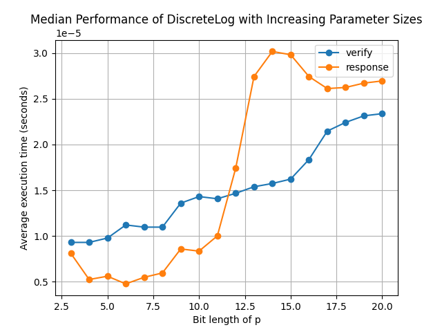 |   | 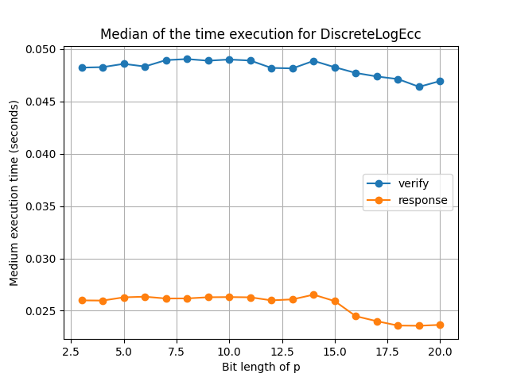 |
| 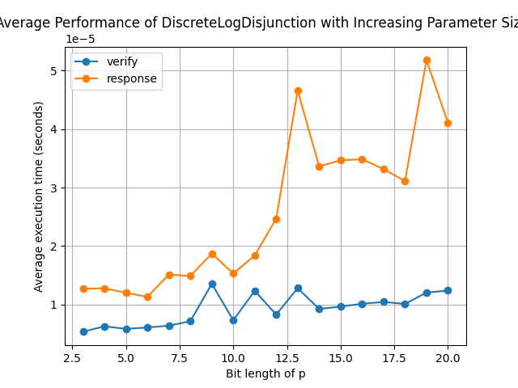   | 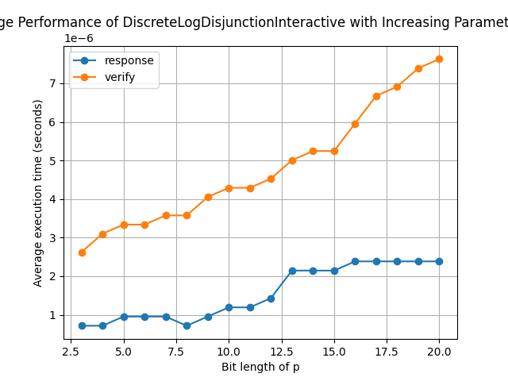  | 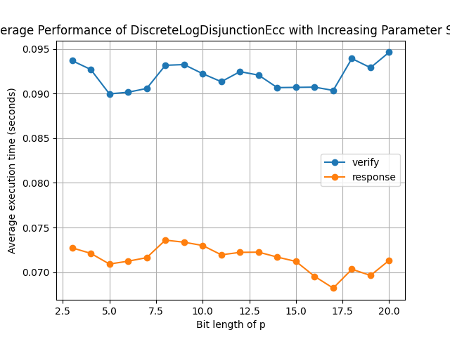 |
| 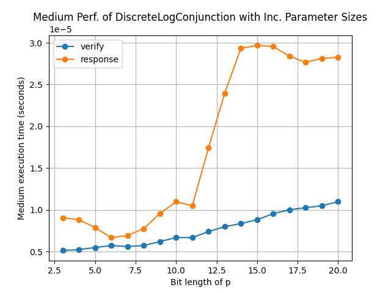   | 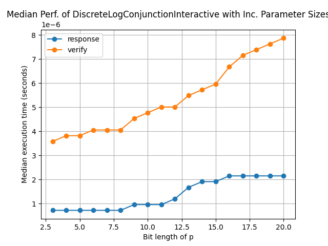  | 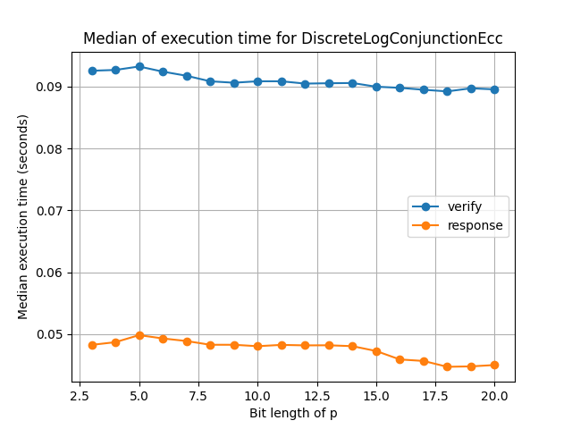 |
| 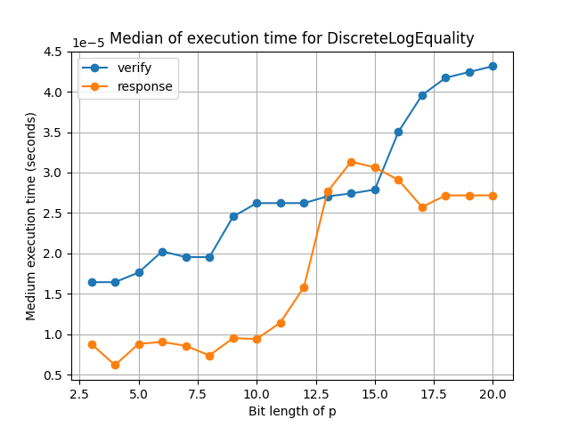   | 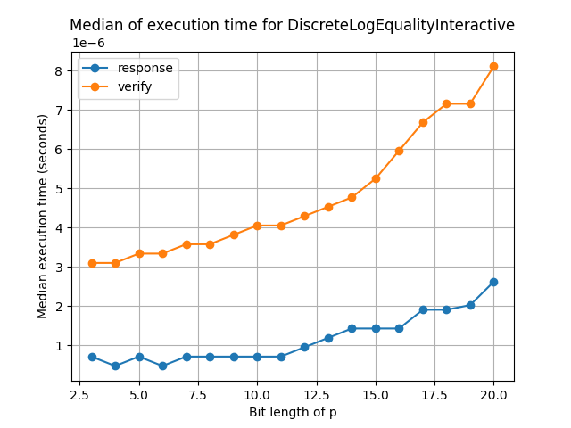  | 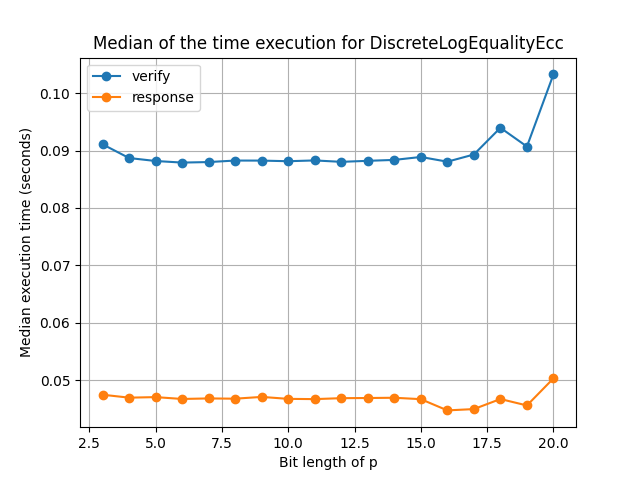 |
| 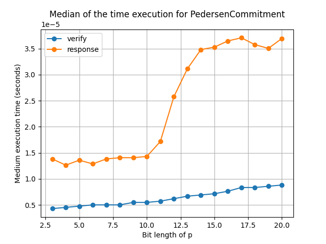   | 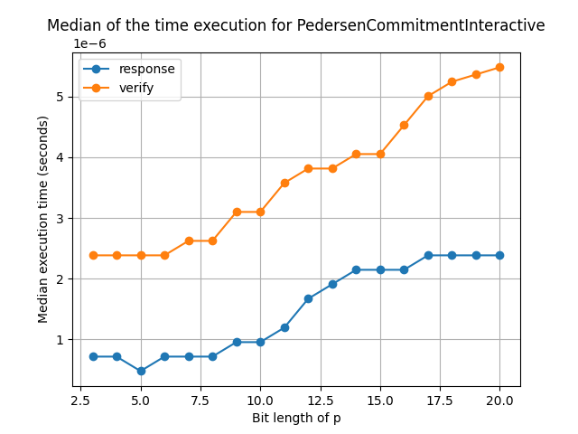  | 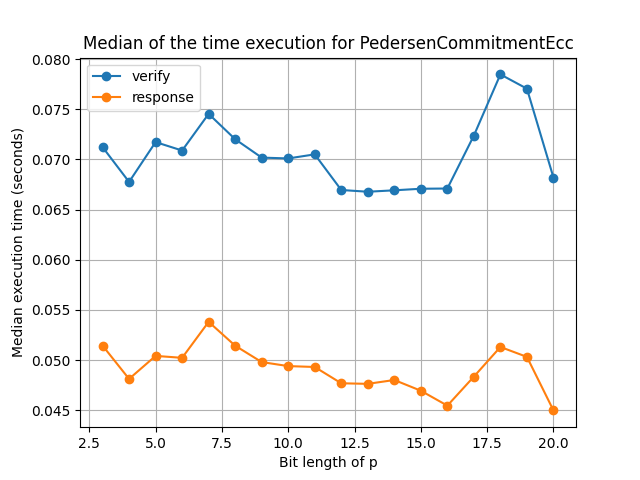 |
| 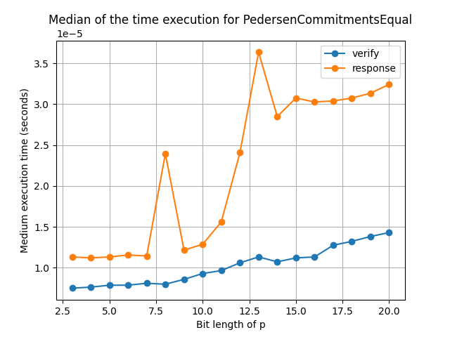   | 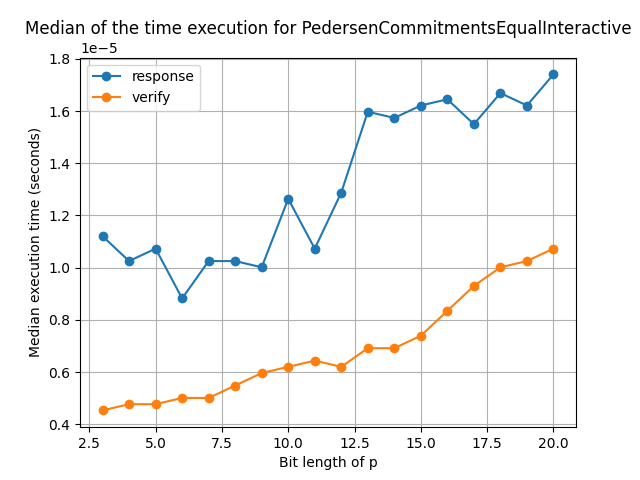  | 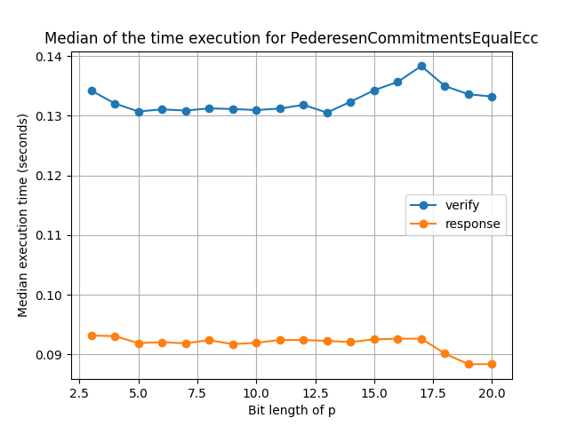 |
| 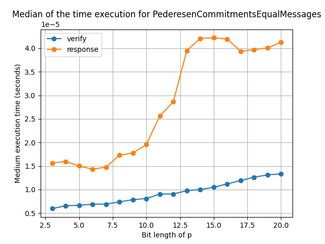   | 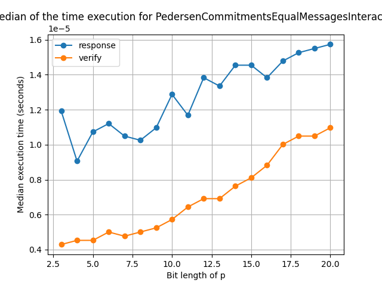  | 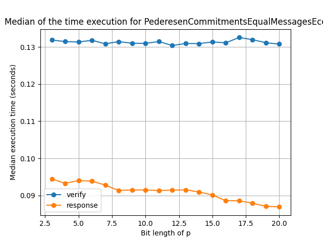 |